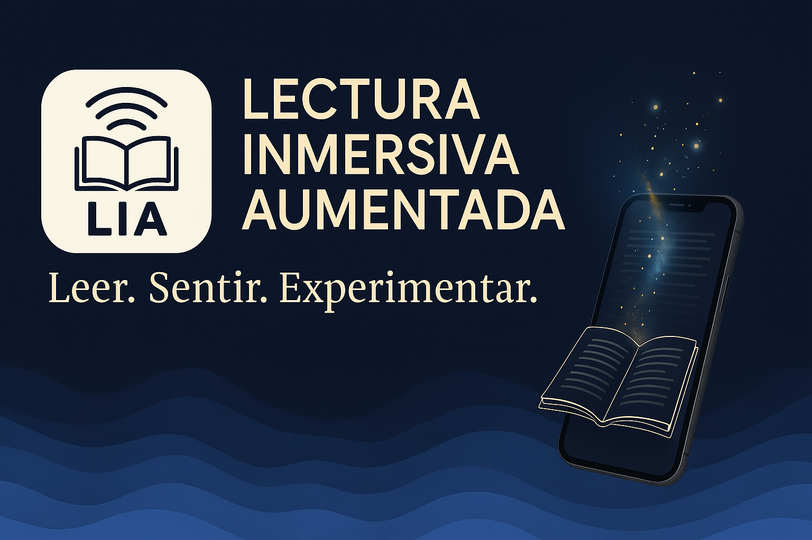

 

  

# LIA – Lectura Inmersiva Aumentada 📚🔊✨

**LIA** es una aplicación Flutter diseñada para transformar la lectura tradicional en una experiencia inmersiva, reactiva y multisensorial. A medida que el lector avanza en voz alta, se activan animaciones, sonidos y efectos visuales sincronizados con el texto, haciendo que cada página cobre vida.

---

## 🚀 Características actuales

- 🎙️ **Lectura por voz**: Avance automático al pronunciar la última palabra de cada página.
- 🎨 **Animaciones contextuales**: Imágenes y sonidos se activan al detectar palabras clave.
- 📖 **Modo clásico e inmersivo**: Elige cómo disfrutar cada capítulo.
- 💾 **Progreso guardado**: Continúa la lectura desde donde la dejaste.
- 🔄 **Interfaz adaptativa**: Optimizada para móviles, tabletas y pantallas grandes.

---

## 🌐 Visión a futuro: Plataforma de lectura colaborativa y comercial

LIA no solo es una app de lectura: será una **plataforma interactiva para autores, lectores y amantes de los libros**. Estas son algunas de las funciones planeadas:

- 🖊️ **Publicación abierta para nuevos autores**: Cualquier escritor podrá subir sus libros a LIA.
- 💳 **Comercialización de libros**: Los libros podrán ser vendidos directamente en la app.
- 📚 **Biblioteca social**: Los lectores podrán compartir lecturas, reseñas y recomendaciones.
- 🏆 **Gamificación del hábito lector**: Los usuarios competirán en niveles de lectura, estadísticas de progreso, desafíos diarios y más.
- 🧠 **Comunidad lectora con rankings**: ¿Quién leyó más esta semana? ¿Quién desbloqueó más finales alternativos?

---

## 📱 Tecnología

Construida con:

- **Flutter**
- `speech_to_text` para reconocimiento de voz
- `audioplayers` para ambientación sonora
- `shared_preferences` para guardar progreso
- Diseño responsive y enfoque en experiencia del usuario

---

## 🧑‍💻 Autor

**Miguel Tovar Amaral**  
Desarrollador, narrador, visionario creativo.  
Contacto: **miguel.tovar@lasagadeangelo.com.mx**

---

## 📜 Licencia y derechos

> **Todos los derechos reservados.**  
> Este software y su contenido son propiedad exclusiva de Miguel Tovar Amaral.  
> **Se prohíbe su reproducción, modificación, distribución o uso comercial sin consentimiento expreso y por escrito del autor.**

Para licencias comerciales o distribución, contactar a:  
**miguel.tovar@lasagadeangelo.com.mx**  

---
